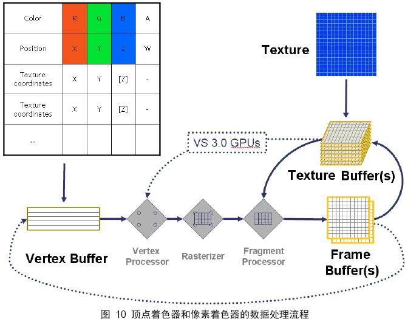

opengl中的顶点着色器和片段着色器，与GPU 可编程顶点处理器 和 可编程片段处理器对应。由于GPU对数据进行并行处理，所以每个数据都会执行一次shader程序程序。即，每个顶点数据都会执行一次顶点程序；每个片段都会执行一次片段程序。

## 顶点处理器
顶点着色程序从GPU前端模块（寄存器）中提取图元信息（顶点位置、法向量、纹理坐标等），并完成顶点坐标空间转换、法向量空间转换、光照计算等操作，最后将计算好的数据传送到指定寄存器中；然后片断着色程序从中获取需要的数据，通常为“纹理坐标、光照信息等”，并根据这些信息以及从应用程序传递的纹理信息（如果有的话）进行每个片断的颜色计算，最后将处理后的数据送光栅操作模块。

其中顶点信息 ---》vertex buffer
文理信息 ---》texture buffer

### 参考
[着色器理解](http://blog.csdn.net/onafioo/article/details/38983197)